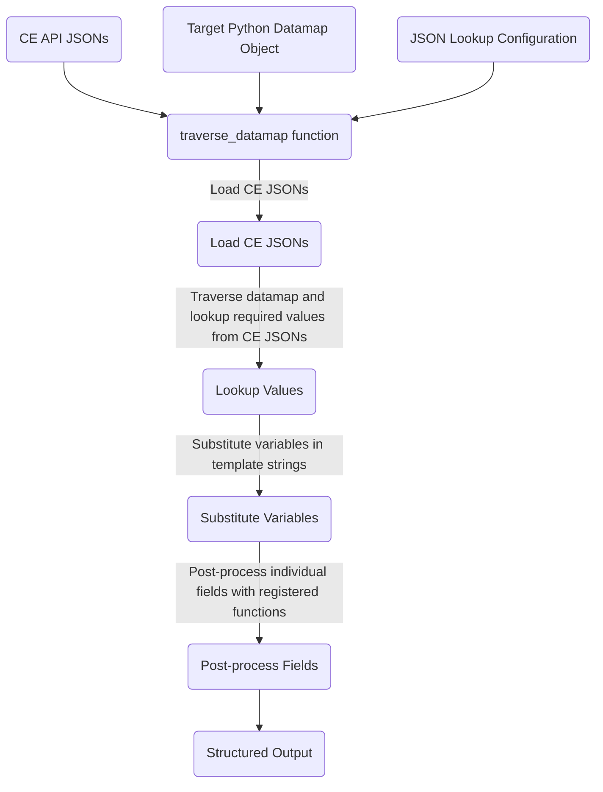

|   | <h2>Ce<sub>2</sub>Ocf (Contract Express to OCF)</h2> |
|---|------------------------------------------------------|

CE<sub>2</sub>OCF is a data transformation tool designed to convert flat, unstructured data sourced from Contract
Express (CE) systems into complex, structured JSONs. It's been configured in this repository specifically to produce
[Open Cap Format (OCF)](https://github.com/Open-Cap-Table-Coalition/Open-Cap-Format-OCF) data.

## Overview

At its heart, the data restructuring process is orchestrated by the `traverse_datamap()` function in
[`Ce2Ocf.datamap.crawler`](./Ce2Ocf/datamap/crawler.py). This function takes three key inputs:
1. [CE JSONs](docs/Contract%20Express%20to%20API%20Concepts/API%20Outputs.md),
2. A [Python datamap](docs/datamaps.md) describing your desired schema - e.g. an OCF stakeholder
3. A [JSON datamap parser configuration](docs/configuring%20datamap%20lookups.md) specifying how the desired schema
   should be populated with ce variables.



## Customizing to Your CE Questionnaire

Follow our [quickstart guide](docs/quickstart.md) to see how to get started using our out-of-the-box parser
configuration files. As you'll quickly see, CE<sub>2</sub>OCF is extremely powerful and can handle tremendous
complexity. For starters, you can customize the [default datamap parser configurations](Ce2Ocf/datamap/defaults)
to suit your template. If you need more flexibility, try composing our [OCF datamap objects](Ce2Ocf/ocf/datamaps.py)
and using these in the order best-suited to your CE data. For maximal flexibility, you can build totally custom datamaps
out of our [datamap primitives](Ce2Ocf/datamap/definitions.py), provided you firmly understand [how datamaps are used
to steer our data parser](docs/datamaps.md).


## Installation

Assuming you are in a Python environment with Python >=3.9, you can install directly from this repo via:

```
pip install git+https://github.com/gunderson-dettmer/CE2OCF
```

## Quick Start

For those eager to get started, we have prepared a [Quick Start guide](docs/quickstart.md) that walks you through using
a pre-built pipeline and basic customization of parser configuration.

## Setup the Development Environment

Please see our [developer getting started guide](docs/dev%20environment.md)

## Acknowledgements

Thanks to the [Open Cap Table Coalition](https://www.opencaptablecoalition.com/) for its tireless efforts to promote
data standards for cap table data, and for the numerous member organizations and freelance contributors who have
donated their time and expertise to the
[Open Cap Format (OCF)](https://github.com/Open-Cap-Table-Coalition/Open-Cap-Format-OCF).
