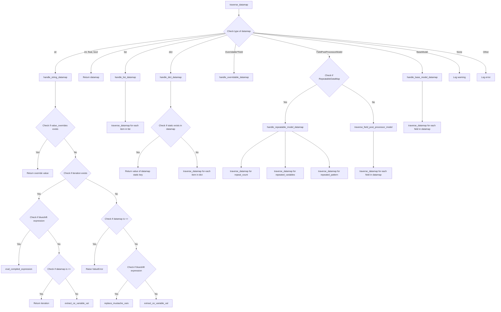

# Configuraing CE Value Lookup for a Datamap

## Overview

As described in the [datamap documentation](datamaps.md), the Python datamap objects describe target datashapes and,
depending on which building-blocks you use, the `traverse_datamap()` function will traverse the datamap object and
apply different conventions to lookup values from your CE JSONs to populate the datamap.

**In order to do this, you need three things:**
1. Your CE JSONs from the CE API
2. A suitable Python datamap
2. A datamap parsing configuration JSON that matches the selected datamap and which specifies what to lookup from CE.

## `traverse_datamap()`

### Overview

The `traverse_datamap()` functions is the heart of CE<sub>2</sub>OCF and is powerful tool for transforming data. It
takes a flat list of responses from a CE (Customer Engagement) system and uses a "datamap" to shape this data into a
more complex, structured format.

You can think of the datamap as a blueprint or a recipe. It's a set of instructions, written in JSON, that describes
how to take the flat list of responses and build it into a more complex object.

For example, imagine you have a list of responses from a survey, where each response is a simple pair of a question
and an answer. The datamap might instruct the function to group these responses by respondent, and then within each
respondent, group the responses by the category of the question. The result would be a complex object that organizes
the responses in a way that's much more useful and easier to analyze.

The beauty of this function is that it's very flexible. By changing the datamap, you can change the way the data is
structured without having to change the function itself. This makes it a powerful tool for data transformation.

Moreover, the function is designed to handle a variety of different data types and structures. It can handle simple
data types like strings and numbers, as well as more complex types like lists and dictionaries. It can even handle
custom data types defined using Pydantic, a Python library for data validation.

In summary, traverse_datamap() is a function that takes a flat list of responses and a JSON datamap, and uses them to
build a complex, structured object. It's a flexible and powerful tool for transforming and organizing data.

### `traverse_datamap()` Traversal Logic

The function starts by checking the type of the datamap. Depending on the type, it calls a corresponding handler function:

- If the datamap is a string, it calls handle_string_datamap(). This function checks if there are any override values
  provided. If not, it checks if the datamap is a "blueshift expression" or a variable name and processes it
  accordingly.
- If the datamap is a list, it calls handle_list_datamap(). This function iterates over the list and recursively calls
  traverse_datamap() for each item.
- If the datamap is a dictionary, it calls handle_dict_datamap(). This function checks if the dictionary contains a
  "static" key. If not, it recursively calls traverse_datamap() for each item in the dictionary.
- If the datamap is an instance of Overridable*Field, it calls handle_overridable_datamap() which simply returns the
  static value of the datamap.
- If the datamap is an instance of FieldPostProcessorModel, it checks if it's a subclass of RepeatableDataMap. If it
  is, it calls handle_repeatable_model_datamap(), otherwise it calls traverse_field_post_processor_model(). Both of
  these functions process the datamap according to their specific logic and may recursively call traverse_datamap().
- If the datamap is an instance of BaseModel, it calls handle_base_model_datamap(). This function iterates over the
  fields of the datamap and recursively calls traverse_datamap() for each field.

After the handler function is done, traverse_datamap() checks if there's a post-processor function provided. These post
processors can be registered on a class-wide basis on a subclass of FieldPostProcessorModel or RepeatableDataMap. If
there is a postprocessor registered, a given recursive leval of the traverse_datamap() function will call it with
the result from the handler function and the list of objects to extract values from.

Finally, the function returns the result. If the result is an empty dictionary, it returns None instead.

### Flowchart of `traverse_datamap()` Traversal Logic



### Arguments

The function takes the following parameters:

- `datamap`: The current level of the datamap.
- `field_name`: Field name we're looking for.
- `ce_objs`: The list of objects to extract values from.
- `post_processor`: A function to process the extracted value for field_name. Expects two args, raw value, and the
  ce_json list.
- `iteration`: Where we want to parse CE objs for multiple repetitions of the same values, set iteration to indicate
  which iteration to look at.
- `value_overrides`: If this is populated, check to see if leaf value variable name is in this dict, and if so, use
  value provided in dict.
- `fail_on_missing_variable`: If set to true, if any CE variable is NOT found, the function will raise a ValueError.
- `drop_null_leaves`: If True, don't retain leaf keys where value is null / None.

## JSON Lookup Configuration

The JSON Lookup Configuration is a critical tool in the datamap parsing process. It is a JSON object that aligns with
the selected datamap and specifies what values to lookup from the CE (Contract Express) system. We can then use this
JSON to instantiate the desired datamap like. For example, if we have a configuration for Stockholders, we could do this
`StockholderDataMap.parse_file(<path to configuration>)`. Then the resulting `StockholderDataMap` could be used with
`traverse_datamap()`.

The flexibility of the JSON Lookup Configuration allows for varied and complex data extraction procedures without
needing to modify the underlying codebase.

### Stakeholder Example

Consider a datamap for a stakeholder:

```python
class StockholderDataMap(FieldPostProcessorModel):
    id: Union[str, OverridableStringField] = Field(default_factory=lambda: {"static": uuid.uuid4().__str__()})
    object_type: OverridableStringField = Field(default_factory=lambda: {"static": "STAKEHOLDER"})
    name: StockholderInfoDataMap
    stakeholder_type: OverridableStringField = Field(default_factory=lambda: {"static": "INDIVIDUAL"})
    issuer_assigned_id: Union[str, OverridableStringField]
    current_relationship: Union[str, OverridableStringField] = Field(default_factory=lambda: {"static": "FOUNDER"})
    primary_contact: StockholderPrimaryContact
    addresses: list[AddressDataMap]
    tax_ids: list = []
    comments: list[Union[str, OverridableStringField]]
```

This datamap outlines the structure of the expected data for a stakeholder, including their ID, type, name, contact
information, and more.

To guide the data extraction process, a corresponding JSON Lookup Configuration might look like this:

```json
{
  "repeat_count": "NumberStockholders",
  "repeated_variables": "StockholderInfoSame",
  "repeated_pattern": {
    "id": "<<LOOP_INDEX>>",
    "name": {
      "legal_name": "Stockholder"
    },
    "issuer_assigned_id": "<<LOOP_INDEX>>",
    "primary_contact": {
      "name": {
        "legal_name": "Stockholder"
      },
      "emails": [
        {
          "email_address": "EmailAddress"
        }
      ],
      "phone_numbers": [
        {
          "phone_number": "PhoneNumber",
          "phone_type": {
            "static": "HOME"
          }
        }
      ]
    },
    "addresses": [
      {
        "city": "StockholderCity",
        "country_subdivision": "StockholderState",
        "street_suite": "StockholderStreet",
        "postal_code": "StockholderZip"
      }
    ],
    "comments": [
      "|Auto-generated by CE2OCF Contract Express Parser v{{PARSER_VERSION}}|"
    ]
  }
}
```

In this configuration, each key-value pair aligns with a field in the datamap. The values indicate either a static
value to be used (like `"HOME"` for the phone type) or a variable name to lookup in the CE JSON (like `"Stockholder"`
for the legal name).

The configuration also specifies how to handle repeated variables with the `repeat_count`, `repeated_variables`,
and `repeated_pattern` keys. This allows the `traverse_datamap()` function to correctly handle multiple instances of
the same data structure.

This combination of the datamap and the JSON Lookup Configuration provides a flexible and powerful tool for
transforming raw data into a structured and analyzable format.

### Lookup Syntax Cheatsheet

As you've no-doubt noticed, depending on the data type of the leaf values of the Python datamap, `traverse_datamap()`
will perform a lookup for target values very differently. Here's a quick summary of the different options:

| Value Type in Datamap | Syntax                                                                                                   | Features |
| --- |----------------------------------------------------------------------------------------------------------| --- |
| String | `"variable_name"`                                                                                        | This will lookup a value from the source data using the provided variable name. |
| String (CE2OCF Expression) | `\|{{variable1}} + {{variable2}} * 2\|`, `\|[{{variable1}} + {{variable2}} * 2]\|`, etc.                 | This will trigger a template parser. The parser searches for double moustache groups `{{...}}` within the string, replaces these with their respective values using a lookup function, and then evaluates the resulting expression. If the expression is enclosed in square brackets `[]`, it will be evaluated using Python's eval function. Note: This can be unsafe for untrusted inputs. All variables in the expressions should be numeric. The parser does not handle nested expressions or non-numeric data types within the expressions. Ensure that the variable names used in the expressions match exactly with the variable names in the source data. |
| Number (int, float) | `123`, `45.67`                                                                                           | This will directly use the provided number value. |
| Boolean | `true`, `false`                                                                                          | This will directly use the provided boolean value. |
| List | `["var1", "var2", {...}]`                                                                                | This will process each item in the list. |
| Dictionary | `{"key1": "var1", "key2": {...}}`                                                                        | This will process each value in the dictionary. |
| `Overridable*Field` | `{"OverridableStringField": {"static": "some value"}}`                                                   | This will use the static value provided. |
| `RepeatableDataMap` | `{"RepeatableDataMap": {"repeat_count": "var", "repeated_variables": "var", "repeated_pattern": {...}}}` | This will repeat the pattern provided in `repeated_pattern` for the number of times specified in `repeat_count`. The `repeated_variables` will be looked up on loop 1 and then applied to all iterations. |
| `FieldPostProcessorModel` | `{"FieldPostProcessorModel": {"field1": "var1", "field2": "var2", ...}}`                                 | This will process each field in the model. If a postprocessor is registered for a field, it will be run over the resulting model for that field. |
| `BaseModel` | `{"BaseModel": {"field1": "var1", "field2": "var2", ...}}`                                               | This will process each field in the model. |

### Mapping Multiple Values Into a Single Output

#### String Template

If a terminating string is enclosed in pipes `|...|` our template engine will attempt to render the template
to a single string

**Example**

"|{{variable1}} + {{variable2}} * 2|"

In the above example, variable1 and variable2 are placeholders for actual variable names that exist in your data.
The crawler will replace {{variable1}} and {{variable2}} with the actual values of variable1 and variable2
respectively, then evaluate the enclosed expression.

For example, if variable1 has a value of 3 and variable2 has a value of 7 in the data, the crawler will replace the
placeholders to get: "3 + 7 * 2".

#### Doing Math With Variables

If you enclose a given part of a string in square brackets [], parser will evaluate the contents first and finally
attempt to resolve any mathematical expressions in the square brackets that have expressions supported by the sympy
symbolic math library. For instance, consider the following expression:

"|[{{variable1}} + {{variable2}} * 2]|"

In this expression, {{variable1}} and {{variable2}} are placeholders for variables. The traverse_datamap() function
will first replace these placeholders with the actual values of variable1 and variable2. Then, the entire expression
enclosed within the square brackets [] will be evaluated. This allows for the computation of dynamic values based on
the data in the CE JSONs. Following our earlier example, if variable1 has a value of 3 and variable2 has a value of 7
in the data, the crawler will replace the placeholders to get: "[3 + 7 * 2]", which after evaluation will yield "17".

This feature of the JSON Lookup Configuration provides a powerful tool for creating dynamic, data-driven expressions.
It allows for complex calculations and transformations to be defined within the configuration, greatly enhancing
the flexibility and power of the data extraction process.

#### Template Syntax Guidelines

**Guidelines on How to Use Templating Syntax:**

- Enclose the Expression in Pipes: The entire expression should be enclosed in pipe characters (|). This is the
  indicator for the parser that the enclosed string is a CE2OCF expression.
- Use Double Moustache for Variables: Variables should be enclosed in double moustache braces ({{variable_name}}).
  The crawler will replace these with the actual values of the variables during processing.
- Use Standard Mathematical Operators: You can use standard mathematical operators such as +, -, *, / in your
  expressions. These will be evaluated as per usual mathematical precedence rules.
- Use Square Brackets for Evaluation: If you want the parser to evaluate an expression, enclose it in square
  brackets ([...]). The parser will evaluate the enclosed expression using Python's eval function.

**Note:**

- Our math evaluation is based on the sympy library's `parse_expr()` function. This can parse a wide variety of
  mathematical expressions, including basic arithmetic operations, exponentiation, trigonometric functions, logarithmic
  functions, and more. Here are a few examples of supported mathematical syntax:
  - Basic arithmetic operations: {{variable1}} + {{variable2}}, {{variable1}} - {{variable2}}, {{variable1}} *
    {{variable2}}, {{variable1}} / {{variable2}}
  - Exponentiation: {{variable1}}**{{variable2}}
  - Trigonometric functions: sin({{variable1}}), cos({{variable1}}), tan({{variable1}})
  - Logarithmic functions: log({{variable1}}), log({{variable1}}, {{base}})
  - See [sympy documentation](https://www.sympy.org/en/index.html) for more supported operators.
  - This should be fairly safe, though if there are underlying vulnerabilities in sympy's evaluator our library will
    have the same. The most obvious "attack" would be someone maliciously using values that create enormous numbers or
    long-running / infinite calculations. While annoying, the damage caused would just be an unresponsive system, and
    the attacked would need intricate knowledge of your system and this library.
- When constructing CE2OCF expressions, ensure that the variable names used in the expressions match exactly with
  the variable names in the source data.
- The parser does not handle nested expressions. Make sure your expressions are not nested. For example,
  "|[{{var1}} + ({{var2}} * 2)]|" will not be parsed correctly. Instead, you should write it as
  "|[{{var1}} + {{var2}} * 2]|".
- The parser does not handle strings or other non-numeric data types within the expressions. All variables in the
  expressions should be numeric.

## Post-Processing Parsed Values

The `FieldPostProcessorModel` class allows you to register a post-processor function for individual fields. A
post-processor is a function that is run over the resulting model for a specified field after the initial value
has been obtained.

The post-processor function should be a callable that takes two arguments: the raw value and the `ce_json` list.
It should return the processed value.

### Registering Post-Processors

To register a post-processor, you need to use the `register_handlers` method of the `FieldPostProcessorModel` class.
You should pass a dictionary that maps field names to their respective post-processing functions.

Here is an example:

```python
def my_post_processor(value, ce_json):
    # Process the value
    return processed_value

FieldPostProcessorModel.register_handlers({
    "field_name": my_post_processor
})
```

### Unregistering Post-Processors

To unregister all post-processors, you can use the `clear_handlers` method of the `FieldPostProcessorModel` class. This
method does not take any parameters and will remove all registered post-processors:

```python
FieldPostProcessorModel.clear_handlers()
```

To unregister a specific post-processor, you would need to manually remove it from the `_field_postprocessors`
dictionary:

```python
del FieldPostProcessorModel._field_postprocessors["field_name"]
```
